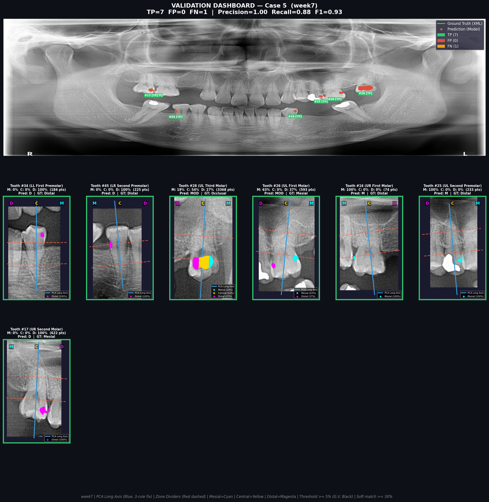

# Dental Caries & Surface Detection System


A multi-stage computer vision pipeline for automated **dental caries detection** and **surface classification** from panoramic dental X-rays (OPG). The system identifies caries lesions, maps them to specific teeth using FDI notation, and classifies the affected surface (Occlusal, Mesial, Distal, Lingual) using PCA-based orientation analysis and point-cloud voting.

> **Final Performance (Week 7):** Precision **99.1%** | Recall **72.0%** | F1-Score **83.4%** | Soft Surface Accuracy **100%**

---

## Team Members

| Name | Student ID | GitHub | Email |
| :--- | :--- | :--- | :--- |
| **Sukollapat Pisuchpen** (Pond) | 6687052 | [@SukollapatPis](https://github.com/SukollapatPis) | <sukollapat.pis@gmail.com> |
| **Pichitchai Paecharoenchai** (Jao) | 6687033 | [@pichitchaipae](https://github.com/pichitchaipae) | <jao.pichitchai@gmail.com> |
| **Naris Pholpak** (Phai) | 6687025 | [@1tshadowz](https://github.com/1tshadowz) | <phainaris@gmail.com> |

**Faculty:** Faculty of Information and Communication Technology (ICT), Mahidol University
**Advisor:** Dr. Sirawich Vachmanus (<sirawich.vac@mahidol.ac.th>)

---

## Project Objectives

### 1. Tooth Segmentation & Identification (FDI Notation)

- Segment and identify all 32 teeth in panoramic X-rays using the FDI (ISO 3950) two-digit notation system.
- Two-stage approach: YOLO panoramic detection → Detectron2 fine segmentation.

### 2. Caries Detection

- Detect dental caries lesions using YOLOv8s trained on 3 classes: **Occlusal**, **Proximal**, and **Lingual**.
- Map detected caries to specific teeth via pixel-level containment matching.

### 3. Caries Surface Classification

- Classify the specific surface affected by caries using PCA orientation normalization and **Multi-Zone Point-Cloud Voting** (Mesial / Central / Distal zones).
- Generates combined surface labels: **O, MO, DO, MOD, L**, etc.

---

## Pipeline Architecture

```text
┌──────────────────────────────────────────────────────────────────────┐
│                   INPUT: Panoramic Dental X-ray (OPG)                │
└──────────────────────────────────────────────────────────────────────┘
                                  │
                    ┌─────────────┴─────────────┐
                    ▼                           ▼
         ┌──────────────────┐        ┌──────────────────────┐
         │ Stage 1: Tooth   │        │ Stage 2: Caries      │
         │ Segmentation     │        │ Detection            │
         │ (YOLOv11m-seg +  │        │ (YOLOv8s, 3-class)   │
         │  Detectron2)     │        │                      │
         └────────┬─────────┘        └──────────┬───────────┘
                  │                              │
                  └──────────┬───────────────────┘
                             ▼
              ┌──────────────────────────────┐
              │ Stage 3: Caries-to-Tooth     │
              │ Mapping (Pixel Containment)  │
              └──────────────┬───────────────┘
                             ▼
              ┌──────────────────────────────┐
              │ Stage 4: Surface             │
              │ Classification               │
              │ (PCA + M-C-D Zone Voting)    │
              └──────────────┬───────────────┘
                             ▼
              ┌──────────────────────────────┐
              │ OUTPUT: Tooth ID + Surface   │
              │ e.g., Tooth 36 — Occlusal   │
              │       Tooth 45 — MO          │
              └──────────────────────────────┘
```

---

## Results

Evaluated on **500 panoramic dental X-ray cases** with expert-annotated AIM-XML ground truth.

| Metric | Value |
| :--- | :--- |
| True Positives (TP) | 1,424 |
| False Positives (FP) | 13 |
| False Negatives (FN) | 555 |
| **Precision** | **0.9910** |
| **Recall** | **0.7196** |
| **F1-Score** | **0.8337** |
| **Strict Surface Accuracy** | **0.7219** |
| **Soft Surface Accuracy** | **1.0000** |

> Precision improved from **83.7% → 99.1%** after eliminating Phantom False Positives (Task 5).
> Surface accuracy improved from **27% → 100%** (soft) after Multi-Zone Voting (Week 6), PCA fixes + Soft Matching (Week 7).
>
> "Soft" accuracy counts Proximal ↔ Mesial/Distal as correct; "Strict" requires exact surface name.

### Sample Output

**Per-case validation dashboard** — panoramic overview with TP/FP/FN annotations and per-tooth PCA zone panels:

<p align="center">
  
</p>

**Per-tooth PCA orientation fix** — eigenvector correction for squarish molars with M-C-D zone voting:

<p align="center">
  
</p>

---

## Project Structure

```text
SP/
├── material/                           # Raw data & pre-trained models (excluded from git)
│   ├── 500 cases with annotation/      #   500 panoramic X-rays + AIM-XML annotations
│   ├── 500-roi/                        #   Binary ROI caries masks
│   └── Tooth Segmentation + Recognition model/
│       └── weights/                    #   Pre-trained YOLO & Detectron2 weights
│
├── week1/                              # Tooth Segmentation Model Training
│   ├── train.py                        #   YOLOv11m-seg training (32 FDI classes)
│   ├── prepare_dataset.py              #   XML annotation → YOLO format converter
│   ├── data.yaml                       #   Dataset config (class names, paths)
│   └── ...
│
├── week2/                              # Tooth Segmentation Inference (500 Cases)
│   ├── process_500_cases.py            #   Batch processing: YOLO + Detectron2 pipeline
│   └── README_500_cases.md             #   Processing documentation
│
├── week3/                              # Caries-to-Tooth Mapping (v1)
│   └── dental_caries_analysis.py       #   Overlay tooth coords on ROI masks
│
├── week4/                              # Caries Detection Pipeline
│   ├── inference.py                    #   Main detection (YOLOv8s + Detectron2 mapping)
│   ├── train_caries.py                 #   Train caries detection model (3-class)
│   ├── prepare_caries_dataset.py       #   Extract caries annotations → YOLO format
│   ├── run_full_batch_v3_advanced.py   #   Production batch processor (500 cases)
│   ├── main/                           #   High-accuracy inference config variant
│   └── README.md                       #   Pipeline documentation
│
├── week5/                              # Surface Classification v1 (PCA + OBB)
│   ├── caries_surface_classifier.py    #   PCA-based surface zone classifier
│   ├── process_surface_classification.py  # Batch surface classification
│   ├── visualization_utils.py          #   Debug visualization tools
│   └── test_classification.py          #   Unit tests
│
├── week6/                              # Surface Classification v2 + Evaluation (baseline)
│   ├── multi_zone_classifier.py        #   M-C-D Point-Cloud Voting classifier (v1)
│   ├── evaluation_engine.py            #   End-to-end evaluation pipeline (v1)
│   ├── xml_ground_truth_parser.py      #   AIM-XML ground truth parser
│   ├── snodent_tooth_map.py            #   SNODENT code → FDI notation mapper
│   ├── validation_dashboard.py         #   Results visualization dashboard (v1)
│   ├── presentation_script.md          #   Final presentation script
│   └── ...
│
├── week7/                              # Pipeline Hardening & Final Evaluation
│   ├── multi_zone_classifier.py        #   4-rule PCA orientation + M/D flip fix
│   ├── evaluation_engine.py            #   Soft-match eval + phantom FP filter
│   ├── dental_caries_analysis.py       #   Boundary erosion + unassigned caries
│   ├── validation_dashboard.py         #   Per-tooth PCA debug dashboard
│   ├── select_hero_shots_v2.py         #   5-category hero-shot selector
│   ├── snodent_tooth_map.py            #   importlib wrapper → week6
│   ├── xml_ground_truth_parser.py      #   importlib wrapper → week6
│   ├── dental_analysis_output/         #   500-case caries mapping + dashboards
│   ├── evaluation_output/              #   Final eval CSV + confusion matrices
│   └── hero_shots/                     #   25 curated validation dashboards
│
├── requirements.txt                    # Python dependencies
├── .gitignore
└── README.md                           # This file
```

---

## Technology Stack

| Category | Technologies |
| :--- | :--- |
| **Language** | Python 3.10+ |
| **Object Detection** | [Ultralytics YOLOv8/v11](https://github.com/ultralytics/ultralytics) |
| **Instance Segmentation** | [Detectron2](https://github.com/facebookresearch/detectron2) |
| **Point Cloud / PCA** | OpenCV (`cv2.PCACompute`), NumPy |
| **Visualization** | Matplotlib, Seaborn, OpenCV |
| **Data Processing** | Pandas, NumPy, tqdm |
| **GPU** | PyTorch + CUDA (tested on RTX 4080 12GB) |

---

## Installation

### Prerequisites

- Python 3.10+
- CUDA-compatible GPU (recommended)
- Conda (recommended for environment management)

### Setup

```bash
# Clone the repository
git clone https://github.com/pichitchaipae/dental-caries-detection.git
cd dental-caries-detection

# Create conda environment
conda create -n dental python=3.10 -y
conda activate dental

# Install dependencies
pip install -r requirements.txt

# Install Detectron2 (requires PyTorch pre-installed)
pip install 'git+https://github.com/facebookresearch/detectron2.git'
```

---

## Weekly Development Progress

| Week | Phase | Description | Key Output |
| :--- | :--- | :--- | :--- |
| **1** | Tooth Segmentation Training | Train YOLOv11m-seg on 500 cases (32 FDI classes, 80/20 split) | Tooth segmentation model |
| **2** | Tooth Segmentation Inference | Run YOLO + Detectron2 two-stage pipeline on all 500 cases | Per-tooth pixel coordinates (JSON) |
| **3** | Caries-to-Tooth Mapping | Overlay tooth coordinates on binary ROI caries masks | Caries mapping per tooth (JSON + CSV) |
| **4** | Caries Detection Pipeline | Train YOLOv8s (3-class) + build full inference pipeline | Caries bounding boxes + tooth mapping |
| **5** | Surface Classification v1 | PCA orientation + OBB zone classification | Surface labels (O/P/L) |
| **6** | Surface Classification v2 + Evaluation | Multi-Zone M-C-D Point-Cloud Voting + full evaluation | F1=0.89, Surface Acc=87% (baseline) |
| **7** | Pipeline Hardening | 4-rule PCA fix, boundary erosion, M/D flip fix, soft-match eval, phantom FP elimination | **F1=0.83, Prec=99.1%, Soft Acc=100%** |

> **Getting started with Week 7?** See [`week7/README.md`](week7/README.md) for the complete prerequisites checklist, verification script, and step-by-step reproduction guide.

---

## References

- **FDI Notation:** ISO 3950 — Two-digit tooth numbering system by the World Dental Federation
- **SNODENT:** Systemized Nomenclature of Dentistry (ADA)
- **AIM XML:** Annotation and Image Markup (NCI/Northwestern Radiology)
- **G.V. Black Classification:** Cavity classification system for dental caries

---

## License

This project is developed as part of the ITDS346 PRACTICAL DATA SCIENCE, ITDS491 SENIOR PROJECT I, and ITDS492 SENIOR PROJECT II coursework at the Faculty of ICT, Mahidol University.
