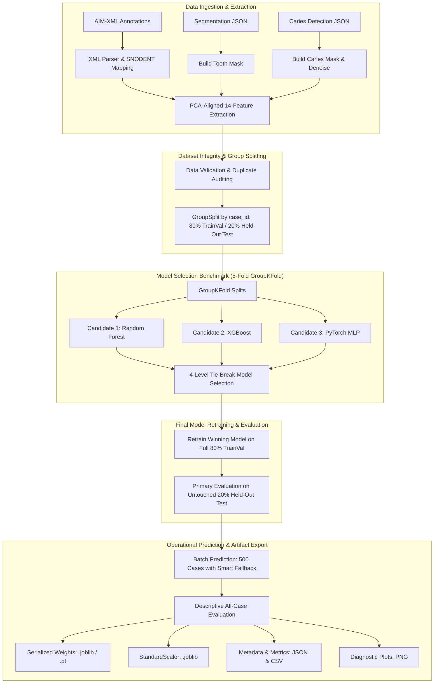
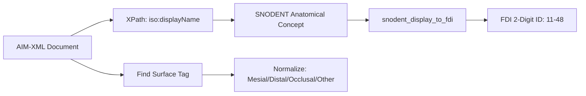

# Dental Caries Surface Classifier (20260806) — Developer Wiki & Architecture Guide

Comprehensive developer documentation for [`caries_surface_classifier_20260806.py`](file:///d:/Mahidol%20University/SP/caries_surface_classification/caries_surface_classifier_20260806.py).

---

## Table of Contents

1. [Executive Summary & Problem Statement](#1-executive-summary--problem-statement)
2. [System Architecture & End-to-End Pipeline](#2-system-architecture--end-to-end-pipeline)
3. [Repository & Directory Structure](#3-repository--directory-structure)
4. [Section-by-Section Deep Dive](#4-section-by-section-deep-dive)
   - [Stage 0: Imports & Reproducibility](#stage-0-imports--reproducibility)
   - [Stage 1: Constants & 14-Feature Geometric Definitions](#stage-1-constants--14-feature-geometric-definitions)
   - [Stage 2: Path Configuration](#stage-2-path-configuration)
   - [Stage 3: XML Ground-Truth Parser & SNODENT-to-FDI Mapping](#stage-3-xml-ground-truth-parser--snodent-to-fdi-mapping)
   - [Stage 4: PCA Alignment & Geometry Engine](#stage-4-pca-alignment--geometry-engine)
   - [Stage 5: File I/O & Feature Extraction](#stage-5-file-io--feature-extraction)
   - [Stage 6: Progress & Utility Helpers](#stage-6-progress--utility-helpers)
   - [Stage 7: Dataset Construction, Validation & Duplicate Auditing](#stage-7-dataset-construction-validation--duplicate-auditing)
   - [Stage 8: Candidate Classifier Architectures (RF, XGBoost, MLP)](#stage-8-candidate-classifier-architectures)
   - [Stage 9: Group-Aware Cross-Validation & 4-Level Model Selection](#stage-9-group-aware-cross-validation--4-level-model-selection)
   - [Stage 10: Final Model Retraining & Held-Out Test Evaluation](#stage-10-final-model-retraining--held-out-test-evaluation)
   - [Stage 11: Rule-Based Baseline (X-Thirds) & Smart Fallback](#stage-11-rule-based-baseline-x-thirds--smart-fallback)
   - [Stage 12: Per-Case Inference & Ground-Truth Matching](#stage-12-per-case-inference--ground-truth-matching)
   - [Stage 13: Publication-Quality Plotting & Visualization](#stage-13-publication-quality-plotting--visualization)
   - [Stage 14: Model Serialization & Reproducibility Metadata](#stage-14-model-serialization--reproducibility-metadata)
   - [Stage 15: Pipeline Orchestration Lifecycle](#stage-15-pipeline-orchestration-lifecycle)
   - [Stage 16: Automated Self-Test Suite](#stage-16-automated-self-test-suite)
5. [Data Schemas & Artifact Specifications](#5-data-schemas--artifact-specifications)
6. [Developer Workflows & CLI Commands](#6-developer-workflows--cli-commands)

---

## 1. Executive Summary & Problem Statement

Automated detection of dental caries from panoramic radiographs (OPGs) traditionally identifies *presence* and *bounding polygon/mask* of lesions. However, clinical operative dentistry requires classifying the **anatomical surface** involved (e.g., **Mesial**, **Distal**, **Occlusal**) for restorative planning and charting under FDI ISO 3950 notation.

```
+--------------------------------------------------------------------------------+
|                             CLINICAL SURFACE TAXONOMY                          |
|                                                                                |
|          Upper Arch (Maxillary)                        Lower Arch (Mandibular) |
|         Quadrant 1  |  Quadrant 2                    Quadrant 4  | Quadrant 3  |
|                     |                                            |             |
|   Distal <-- [Tooth] --> Mesial | Mesial <-- [Tooth] --> Distal  (to Midline)  |
|                                                                                |
|   - Mesial (M): Surface facing toward the dental arch midline.                 |
|   - Distal (D): Surface facing away from the dental arch midline.              |
|   - Occlusal (O): Chewing surface of posterior teeth (premolars & molars).     |
|   - Other: Cervical, buccal/lingual surfaces or unclassifiable 2D projections. |
+--------------------------------------------------------------------------------+
```

### Key Engineering & Scientific Constraints

1. **Small-Sample Tabular Geometry**: The problem reduces to classifying 14 normalized geometric features computed from tooth and caries masks.
2. **Strict Group Isolation**: A patient (case) may have multiple teeth. All teeth from the same patient (`case_id`) must remain in the same partition across training, validation, and testing to prevent optimistic data leakage (Varoquaux et al., 2017).
3. **Imbalanced Classes & Dynamic Support**: Class frequencies in clinical datasets are naturally imbalanced (Distal > Mesial > Occlusal >> Other). Models and metrics dynamically adapt to observed classes.
4. **Empirical Model Selection**: Three distinct paradigms (Random Forest, XGBoost, PyTorch MLP) are benchmarked under identical `GroupKFold` splits, selected via a deterministic 4-level tie-break rule.
5. **Deterministic Production Fallback**: If machine learning inference fails or geometric features cannot be computed, a rule-based **X-Thirds** voting classifier guarantees high operational availability.

---

## 2. System Architecture & End-to-End Pipeline



---

## 3. Repository & Directory Structure

```
d:\Mahidol University\SP\
├── App_Flask_SP\
│   └── output\
│       ├── case 1\ ... case 500\
│       │   └── 39714.xml                  <- Annotation XML (Ground Truth)
├── cropped_teeth_segmentation\
│   ├── crop_teeth_0001\ ... crop_teeth_0500\
│   │   └── crop_teeth_*.json              <- Tooth segmentation coordinates
├── Yolov11-crop_caries_detection\
│   ├── crop_caries_0001\ ... crop_caries_0500\
│   │   └── crop_caries_*.json             <- Caries detection coordinates
└── caries_surface_classification\
    ├── caries_surface_classifier_20260806.py  <- Core Pipeline Implementation
    ├── requirements.txt                       <- Python dependencies
    ├── DEVELOPER_WIKI.md                      <- This document
    └── PCA_Output_Run3\                       <- Default Output Directory
        ├── models\
        │   ├── caries_surface_classifier_20260806.{joblib|pt}
        │   ├── caries_surface_classifier_20260806_scaler.joblib
        │   ├── caries_surface_classifier_20260806_metadata.json
        │   ├── caries_surface_classifier_20260806_cv_results.csv
        │   └── caries_surface_classifier_20260806_test_results.json
        ├── plots\
        │   ├── caries_surface_classifier_20260806_confusion_matrix.png
        │   ├── caries_surface_classifier_20260806_class_metrics.png
        │   ├── caries_surface_classifier_20260806_cv_comparison.png
        │   └── caries_surface_classifier_20260806_feature_importance.png
        └── case_1\ ... case_500\
            └── case_*.json                <- Operational prediction JSONs
```

---

## 4. Section-by-Section Deep Dive

### Stage 0: Imports & Reproducibility

- **Purpose**: Establishes strict determinism across Python, NumPy, and PyTorch runtime environments.
- **Key Mechanics**:
  - `SEED = 42` is set across `random`, `np.random`, and `torch.manual_seed`.
  - Configures `torch.backends.cudnn.deterministic = True` and `torch.backends.cudnn.benchmark = False`.
  - Automatically selects `cuda` if available, otherwise falls back to `cpu`.
  - Declares repeated cross-validation seeds: `SEEDS_FOR_REPEATED_EVAL = [42, 123, 456]` to test model initialization stability while keeping `GroupKFold` patient splits constant.

---

### Stage 1: Constants & 14-Feature Geometric Definitions

The core classifier operates on a 14-dimensional normalized feature vector extracted per tooth-caries pair:

| # | Feature Name | Formula / Definition | Scientific Motivation |
|---|--------------|----------------------|-----------------------|
| 1 | `is_upper` | `quadrant in [1, 2]` | Maxillary teeth (upper) experience different saliva flow dynamics and occlusal anatomy than mandibular teeth. |
| 2 | `x_mean` | $\frac{1}{N}\sum x'_i$ | Normalized horizontal centroid of the lesion (0.0 = left boundary, 1.0 = right boundary of tooth box). |
| 3 | `y_mean` | $\frac{1}{N}\sum y'_i$ | Normalized vertical centroid of the lesion (0.0 = occlusal crown, 1.0 = apical root). |
| 4 | `x_std` | $\sigma_{x'}$ | Horizontal dispersion: distinguishes focal pit-and-fissure caries (low $\sigma$) from spreading smooth-surface lesions (high $\sigma$). |
| 5 | `y_std` | $\sigma_{y'}$ | Vertical dispersion along occluso-gingival axis. |
| 6 | `x_min` | $\min(x')$ | Leftmost extent of lesion in canonical tooth frame. |
| 7 | `x_max` | $\max(x')$ | Rightmost extent of lesion in canonical tooth frame. |
| 8 | `y_min` | $\min(y')$ | Uppermost boundary of lesion. |
| 9 | `y_max` | $\max(y')$ | Lowermost boundary of lesion. |
| 10 | `x_range` | $x_{\max} - x_{\min}$ | Total horizontal span (width) of carious lesion. |
| 11 | `y_range` | $y_{\max} - y_{\min}$ | Total vertical span (depth) of carious lesion. |
| 12 | `x_centroid_dist` | $\|x_{\text{mean}} - 0.5\|$ | Midline offset. Pit-and-fissure occlusal lesions center near $x=0.5$ (value $\approx 0$). Proximal lesions deviate toward 0.0 or 1.0. |
| 13 | `aspect_ratio` | $\text{width}_{\text{tooth}} / \text{height}_{\text{tooth}}$ | Proportional morphology: anteriors (tall/narrow) vs. molars (square/broad). |
| 14 | `coverage` | $N_{\text{caries\_pixels}} / N_{\text{tooth\_pixels}}$ | Fractional surface area of tooth affected by decay. |

---

### Stage 2: Path Configuration

Manages filesystem navigation using `pathlib.Path`:
- `DATA_ROOT`: Base project directory (`d:\Mahidol University\SP`).
- Auto-detects input paths for ground-truth XMLs, tooth segmentation JSONs, and caries detection JSONs.
- `OUTPUT_ROOT`: Target directory (`PCA_Output_Run3`) housing `models/`, `plots/`, and case predictions.

---

### Stage 3: XML Ground-Truth Parser & SNODENT-to-FDI Mapping



- **Namespace Management**: Handles ISO 21090 XML namespaces (`xmlns:iso="uri:iso.org:21090"`).
- **Duplicate Detection**: The `SNODENT_TO_FDI_PAIRS` list is validated via `_build_snodent_map()`. Known ambiguities (e.g., `160770D` mapping to both tooth 16 and tooth 46) raise warnings and default to standard fallback.
- **Robust Text Parsing**: `snodent_display_to_fdi()` uses regex to parse descriptive strings (e.g., *"Structure of maxillary right permanent first molar tooth"* $\to$ `"16"`).

---

### Stage 4: PCA Alignment & Geometry Engine

Panoramic radiographs suffer from severe geometric distortion and dental arch curvature. Raw coordinates conflate tooth tilt with surface position. Stage 4 applies a **4-Rule PCA Transformation**:

```
           Raw Tooth Point Cloud                   PCA-Aligned Canonical Frame
           ---------------------                   ---------------------------
                  /  /                                      +-------+
                 /  /   <-- Tilted                           | Occl. |
                /  /                                        |-------|
               /  /                                         | M / D |
              /  /                                          +-------+
                                                          Crown Upright
```

1. **Eigenvector Selection**: Covariance matrix $\mathbf{C} = \frac{1}{N}\sum (\mathbf{p}_i - \boldsymbol{\mu})(\mathbf{p}_i - \boldsymbol{\mu})^T$ is diagonalized. The eigenvector with larger $|Y|$ component represents the vertical anatomical tooth axis.
2. **Vertical Direction**: Upper-jaw teeth (Quadrants 1–2) orient crown-upward; lower-jaw teeth (Quadrants 3–4) orient crown-downward.
3. **Horizontal Direction**: Oriented toward midline (mesial) per FDI quadrant.
4. **Tilt Clamping**: Rotations exceeding $\pm 45^\circ$ (`MAX_TILT_DEG`) are clamped to $0^\circ$ to prevent runaway distortion from segmentation artifacts.
5. **Denoising**: `remove_small_clusters()` applies 8-connected component analysis to discard isolated artifacts $< 15$ pixels (`MIN_CLUSTER_SIZE`).

---

### Stage 5: File I/O & Feature Extraction

- `_load_seg_case(case_id)` & `_load_caries_case(case_id)`: Safely load and validate case JSONs.
- `_extract_ml_feature_dict(tooth_id, tooth_pts, caries_pts)`:
  1. Computes PCA transformation matrix for `tooth_pts`.
  2. Rotates both tooth and caries coordinates around the tooth centroid.
  3. Projects points into normalized $[0, 1]$ bounding box.
  4. Returns the structured 14-feature dictionary.

---

### Stage 6: Progress & Utility Helpers

- `_progress_bar(current, total, task_name)`: Standardized interactive terminal progress feedback.
- Logging and error suppression wrappers for consistent batch processing.

---

### Stage 7: Dataset Construction, Validation & Duplicate Auditing

- Ingests all 500 cases to build the tabular `DataFrame`.
- **Integrity Validation (`validate_dataset`)**: Checks for missing values, infinite floats, quadrant range $[1, 4]$, and valid surface labels.
- **Duplicate Audit (`audit_and_resolve_duplicates`)**:
  - Exact duplicates (identical coordinates and labels) are safely deduplicated.
  - Conflicting label duplicates for the same `(case_id, tooth_id)` are exported to `{MODEL_STEM}_conflicting_duplicates.csv` and trigger a `ValueError`.
- **`CariesFeatureDataset`**: PyTorch `Dataset` wrapper supporting batch loading.

---

### Stage 8: Candidate Classifier Architectures

#### 1. Class Weighting Formulation
To counteract clinical class imbalance without synthetic oversampling, inverse-frequency class weights are applied:
$$w_c = \frac{N}{K \cdot n_c}$$
*(where $N$ = total samples, $K$ = number of active classes, $n_c$ = samples in class $c$)*.
*Zero-guard*: If any observed class is missing from a training split, `_compute_class_weights()` raises a `ValueError`.

#### 2. Model Candidates
- **Random Forest (`build_rf_model`)**: `n_estimators=200`, `max_depth=10`, `class_weight='balanced'`. Non-linear bagging baseline.
- **XGBoost (`build_xgb_model`)**: `n_estimators=200`, `max_depth=4`, `learning_rate=0.05`, `subsample=0.8`, `colsample_bytree=0.8`. Gradient-boosted decision trees using instance sample weights.
- **PyTorch MLP (`build_mlp_model`)**:
  ```
  Linear(14, 64) -> BatchNorm1d(64) -> ReLU() -> Dropout(0.3)
  Linear(64, 32) -> BatchNorm1d(32) -> ReLU() -> Dropout(0.3)
  Linear(32, num_classes)
  ```
  Trained with Adam optimizer ($\text{lr} = 10^{-3}$), class-weighted Cross-Entropy loss, batch size 32, and early stopping.

---

### Stage 9: Group-Aware Cross-Validation & 4-Level Model Selection

- **Group Leakage Prevention**: `GroupKFold(n_splits=5)` splits by `case_id`. All teeth from a given patient remain in either train or validation.
- **Independent Feature Scaling**: `StandardScaler` is fitted *strictly* on training folds and applied to validation folds.
- **Dynamic Observed Classes**: Classes with 0 support in the dataset are excluded from `LabelEncoder`, ensuring macro F1 is mathematically grounded.
- **4-Level Tie-Break Rule (`select_best_model`)**:
  ```
  Level 1: Highest Mean Macro F1 across CV folds.
             |
             +---> Margin <= 0.01? (Statistical Tie)
                     |
  Level 2: Lowest Standard Deviation (Higher stability).
                     |
                     +---> Tied?
                             |
  Level 3: Highest Minimum Single-Fold F1 (Worst-case resilience).
                             |
                             +---> Tied?
                                     |
  Level 4: Simpler Architecture: RF > XGBoost > MLP (Parsimony principle).
  ```

---

### Stage 10: Final Model Retraining & Held-Out Test Evaluation

- **Retraining Strategy**: Retrains the selected winning architecture on the full 80% train+validation partition.
- **MLP Epoch Scheduling**: To prevent overfitting when retraining on the combined dataset (where no validation set exists for early stopping), the MLP trains for exactly:
  $$\text{Epochs} = \text{median}(\text{best\_epochs from CV})$$
- **Held-Out Test Set**: Evaluated once on the untouched 20% held-out test cases.
- **Metric Verification**: Strictly asserts that internal `_compute_metrics()` macro F1 equals `scikit-learn`'s `classification_report['macro avg']['f1-score']`.

---

### Stage 11: Rule-Based Baseline (X-Thirds) & Smart Fallback

The **X-Thirds** method partitions the PCA-aligned horizontal tooth axis into three regions:
- Left ($x' < 0.40$), Center ($0.40 \le x' \le 0.60$), Right ($x' > 0.60$).
- Caries pixels cast votes into their corresponding region.
- Quadrant logic translates zones into anatomical surfaces:
  - Quadrants 1 & 4 (Patient Right): $\text{Left} \to \text{Distal}, \text{Center} \to \text{Occlusal}, \text{Right} \to \text{Mesial}$.
  - Quadrants 2 & 3 (Patient Left): $\text{Left} \to \text{Mesial}, \text{Center} \to \text{Occlusal}, \text{Right} \to \text{Distal}$.

`classify_with_smart_fallback()` acts as the fault-tolerant inference interface:
```python
Try ML Model Inference -> Fail? -> Try X-Thirds -> Fail? -> Return "Other"
```
Every fallback event records telemetry: `prediction_method`, `fallback_used` (boolean), and `fallback_reason`.

---

### Stage 12: Per-Case Inference & Ground-Truth Matching

- Generates production JSON files for all 500 cases under `PCA_Output_Run3/case_{id}/case_{id}.json`.
- Evaluates operational predictions against XML annotations.
- Explicitly separates and labels:
  - **PRIMARY HELD-OUT GENERALIZATION RESULTS** (unbiased benchmark on test partition).
  - **DESCRIPTIVE ALL-CASE RESULTS** (operational summary across all 500 cases with training caveat).

---

### Stage 13: Publication-Quality Plotting & Visualization

Generates 300 DPI publication figures:
1. **Confusion Matrix Heatmap**: Displays count and normalized percentages across active classes.
2. **Class Metrics Bar Chart**: Per-class Precision, Recall, and F1 comparisons.
3. **Cross-Validation Comparison**: Box/jitter plots illustrating fold-by-fold macro F1 distributions across RF, XGBoost, and MLP.
4. **Feature Importance Plot**: Gini/Gain feature ranking for tree models.

---

### Stage 14: Model Serialization & Reproducibility Metadata

Saves full provenance in `models/`:
- **Model weights**: `.joblib` for RF/XGBoost, `.pt` `state_dict` for PyTorch MLP.
- **Scaler**: `_scaler.joblib`.
- **`_metadata.json`**: Complete snapshot including feature order, scaler $\mu$ and $\sigma$, label mappings, hyperparameters, CV summary, and selection reason.
- **`_cv_results.csv`**: Detailed fold-level metrics for statistical meta-analysis.

---

### Stage 15: Pipeline Orchestration Lifecycle

Orchestrates stages 1–14 in `main()` with clear stage demarcations, progress updates, and terminal summary cards.

---

### Stage 16: Automated Self-Test Suite

Provides unit test verification executable via CLI without requiring the raw 500-case dataset:
- `python caries_surface_classifier_20260806.py --self-test`

**Invariants Checked**:
1. Syntax compilation & import integrity.
2. SNODENT duplicate detection raises on collision.
3. Zero-support classes are cleanly pruned.
4. Dynamic MLP output dimensionality matches active class count.
5. Macro F1 equivalence between internal metric calculator and scikit-learn.
6. Exact duplicate resolution and index pruning.
7. 4-level tie-break rule precedence.
8. `_compute_class_weights` zero-class exception safety.

---

## 5. Data Schemas & Artifact Specifications

### Case Prediction JSON Schema (`case_{id}.json`)

```json
{
  "case_number": 105,
  "teeth_data": [
    {
      "tooth_id": "16",
      "version": "Benchmark_v1",
      "has_caries": true,
      "confidence": 0.94,
      "caries_position_detail": "Distal",
      "predicted_surface_fine": "Distal",
      "prediction_method": "XGBoost",
      "fallback_used": false,
      "fallback_reason": null,
      "tooth_coordinates": [[120, 340], [121, 341]],
      "caries_coordinates": [[125, 345], [126, 346]]
    }
  ]
}
```

### Model Metadata JSON Schema (`*_metadata.json`)

```json
{
  "model_type": "xgboost",
  "model_file": "caries_surface_classifier_20260806.joblib",
  "scaler_file": "caries_surface_classifier_20260806_scaler.joblib",
  "feature_order": ["is_upper", "x_mean", "y_mean", "..."],
  "label_mapping": { "0": "Distal", "1": "Mesial", "2": "Occlusal" },
  "scaler_params": {
    "mean": [0.5, 0.42, "..."],
    "scale": [0.5, 0.12, "..."]
  },
  "random_seeds": [42, 123, 456],
  "cv_summary": {
    "XGBoost": { "mean_f1": 0.7928, "std_f1": 0.0141, "min_f1": 0.7712, "max_f1": 0.8145 }
  },
  "selection_reason": "Highest mean macro F1 (margin > 0.01)",
  "cv_protocol": {
    "fold_assignments_fixed_across_seeds": true,
    "seeds_vary_model_init_only": true
  }
}
```

---

## 6. Developer Workflows & CLI Commands

### 1. Run Automated Invariant Unit Tests (No data dependency)
```bash
python caries_surface_classifier_20260806.py --self-test
```

### 2. Fast Dry-Run / Quick-Test (20 cases, 3-fold CV)
Verify pipeline end-to-end in seconds before launching full run:
```bash
python caries_surface_classifier_20260806.py --quick-test
```

### 3. Multi-Parameter Hyperparameter Sweep (1 Run)
Benchmarks 12 hyperparameter configurations across RF, XGBoost, and MLP, exporting a ranked leaderboard CSV:
```bash
python caries_surface_classifier_20260806.py --sweep
```

### 4. Custom Parameter Execution
Customize folds, seeds, sample size, or skip production JSON generation:
```bash
python caries_surface_classifier_20260806.py --max-cases 100 --cv-folds 10 --seeds 42 123 456 789 --skip-predictions
```

### 5. Full Production Benchmark Execution (Default 500 cases)
```bash
python caries_surface_classifier_20260806.py
```

### 6. Load Trained Model for External Python Inference
```python
import joblib
import json
import numpy as np

# Load artifacts
scaler = joblib.load("PCA_Output_Run3/models/caries_surface_classifier_20260806_scaler.joblib")
model = joblib.load("PCA_Output_Run3/models/caries_surface_classifier_20260806.joblib")
with open("PCA_Output_Run3/models/caries_surface_classifier_20260806_metadata.json") as f:
    meta = json.load(f)

# Raw 14-feature vector
raw_features = np.array([[1, 0.25, 0.35, 0.04, 0.05, 0.21, 0.29, 0.30, 0.40, 0.08, 0.10, 0.25, 0.85, 0.03]])
scaled_features = scaler.transform(raw_features)

pred_idx = model.predict(scaled_features)[0]
pred_surface = meta["label_mapping"][str(pred_idx)]
print(f"Predicted Caries Surface: {pred_surface}")
```

