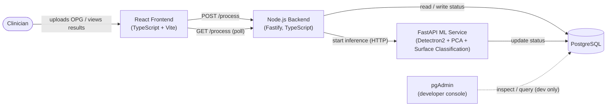

> **Last Updated:** 2026-08-30 15:01:07 +07

# Project Structure Document

## Dental Caries Surface Classification - Stateless Local AI Inference Tool

---

## 1. Overview

This document defines the architecture, component boundaries, data flow,
repository layout, and core design decisions for the **Dental Caries Surface
Classification** system: a locally deployed AI inference tool for dental
clinics.

A clinician uploads a single digital **Orthopantomogram (OPG / panoramic
radiograph)**. The system runs it through a computer-vision pipeline (instance
detection, principal-component axis alignment, and per-surface caries
classification), records processing status in a small operational database,
and returns a structured JSON result together with the source image. The
frontend renders the findings in an interactive on-screen viewer built on the
HTML5 Canvas (bounding boxes and segmentation masks).

The entire system is packaged with Docker Compose. Deployment on a clinic
machine is a single command: `docker compose up -d`.

### 1.1 Statelessness with respect to patient data

The system stores **no patient records**. The database holds only transient
**processing status** for the current job (state, failure message, result
path, timestamp). The uploaded image and the result JSON live in a shared
working volume and are overwritten on each new submission; they are not
archived, indexed, or linked to any patient identifier. Because no
identifiable clinical data is retained, the tool remains outside the scope of
the strictest data-controller obligations under PDPA and medical-records law.
The clinic continues to use its existing paper-based records.

### 1.2 Scope

| In scope | Out of scope |
|---|---|
| Single-image OPG upload and validation | Multi-image or batch studies |
| AI inference pipeline (Detectron2 + PCA + surface classification) | Model training and dataset curation (separate offline repository) |
| Interactive on-screen result viewer (bounding boxes, masks, per-tooth detail) | PDF generation, report export, or any printed/exported artifact |
| Processing-status tracking in a local PostgreSQL database | Patient database, appointment or billing systems |
| Strict single-concurrency with preemption of the running job | Job queue, multi-user concurrency, horizontal scaling |
| Local deployment via Docker Compose | Cloud hosting, reverse proxy / Nginx, PACS / HL7 / DICOM integration |

---

## 2. Technology Stack

| Layer | Technology | Notes |
|---|---|---|
| Frontend | React 18 + TypeScript, built with Vite | Single-page application. Served as static files by Vite's preview server inside the container. No Nginx. |
| Rendering | HTML5 Canvas API | Interactive overlay of bounding boxes, segmentation masks, PCA axes, FDI labels. |
| Backend API | Node.js (TypeScript) with Fastify | Orchestrator and single entry point for the frontend. Handles `POST /process` and `GET /process`, owns the database schema, triggers the ML service. |
| ML Inference Service | Python 3 + FastAPI (Uvicorn) | Runs the Detectron2 + PCA + surface-classification pipeline. Invoked by the Node.js backend; writes status to PostgreSQL directly. |
| ML Runtime | PyTorch, Detectron2, scikit-learn, OpenCV, Pillow | Packaged in the ML service image with pinned versions and model weights. |
| Database | PostgreSQL 16 | Stores processing status only. No patient data. |
| Database Management | pgAdmin 4 | Web console for developers to inspect and query the database during development and support. Not used by the application at runtime. |
| Orchestration | Docker Compose | One-command local deployment; no cloud, no reverse proxy. |
| Inter-service transport | HTTP (JSON) plus a shared Docker volume for image and result files | The browser cannot read Docker volumes, so the source image is returned to it inline as base64. |

---

## 3. Design Principles

1. **No patient data at rest.** The database tracks job state only. Image and
   result files are transient working data, overwritten per run.
2. **Local-first.** The system runs entirely on one clinic workstation or
   on-premise server. No external network access is required at inference
   time.
3. **Single concurrency with preemption.** Exactly one inference runs at a
   time. A new upload cancels the in-progress run and takes its place. There
   is no queue.
4. **Minimal infrastructure.** No reverse proxy, no Nginx, no message broker,
   no cache server. The only non-application service is PostgreSQL, with
   pgAdmin available as an optional developer console.
5. **One-command deployment.** `docker compose up -d` builds, migrates, and
   starts everything with no manual configuration.
6. **Reproducibility.** Model weights and runtime dependencies are
   version-pinned and shipped inside the container images.

---

## 4. System Architecture and Components

### 4.1 Architecture diagram



Text description of the flow:

- The **Clinician** interacts only with the **React Frontend**.
- The **React Frontend** sends the OPG image to the **Node.js Backend** with
  `POST /process`, then polls the backend with `GET /process` on a fixed
  interval until a terminal state is reported.
- The **Node.js Backend** reads and writes the current processing status in
  **PostgreSQL** and triggers the **FastAPI ML Service** over HTTP.
- The **FastAPI ML Service** runs the inference pipeline and writes its
  progress and outcome directly to **PostgreSQL**.
- Image bytes and the result JSON are exchanged between the backend and the ML
  service through a shared Docker volume, not through the database.
- **pgAdmin** is a developer-only console for inspecting PostgreSQL; the
  application never depends on it.

```
+-----------------------------------------------------------------------+
|                     Clinic Workstation (Docker Compose)               |
|                                                                       |
|  Clinician                                                            |
|      |  browser                                                       |
|      v                                                                |
|  +------------------+   POST /process    +----------------------+      |
|  | React Frontend   | -----------------> | Node.js Backend      |      |
|  | Vite preview     |   GET /process     | (Fastify, TS)        |      |
|  | HTML5 Canvas     | <----------------> |                      |      |
|  +------------------+  JSON + base64 img +----+----------+------+      |
|                                              |          |             |
|                             start inference  |          | status R/W  |
|                                    (HTTP)     v          v             |
|                              +---------------------+  +------------+    |
|                              | FastAPI ML Service  |  | PostgreSQL |    |
|                              | Detectron2/PCA/     |->|  status    |<-+ |
|                              | Surface Classifier  |  |            |  | |
|                              +----------+----------+  +------------+  | |
|                                         |   update status ^          | |
|                       shared volume     |                 |          | |
|                    (input.jpg, result.json)               |          | |
|                                                     +------------+    | |
|                                                     |  pgAdmin   |----+ |
|                                                     | (dev only) |      |
|                                                     +------------+      |
+-----------------------------------------------------------------------+
```

> Note: An earlier reference diagram (`zz-claude/image (1).png`) collapsed the
> API tier into a single "Backend (FastAPI)" box. This document splits that
> tier into a **Node.js Backend** (web API and orchestration) and a **FastAPI
> ML Service** (inference only), per the current architecture direction.

### 4.2 React Frontend (TypeScript)

- Single-page application built with React 18 and TypeScript, bundled by Vite,
  served inside its container by `vite preview` on host port `3000`. There is
  no Nginx.
- Responsibilities:
  - OPG file selection and client-side pre-flight validation (format,
    dimensions, size).
  - Submission of the image to the Node.js backend as `multipart/form-data`
    via `POST /process`.
  - Polling `GET /process` every few seconds; stopping on `done` or `fail`.
  - Rendering the interactive result viewer on an HTML5 Canvas: the source
    image (received as base64 from the backend) with bounding boxes,
    segmentation masks, tooth numbering, and PCA axes drawn as toggleable
    overlays.
  - Presenting per-tooth and per-surface classification detail.
- Holds no long-lived state. A page refresh discards the current study; per
  the concurrency rule this also cancels any run still in progress.

### 4.3 Node.js Backend (Fastify, TypeScript)

- Fastify application on host port `8000`. The orchestrator and the single
  entry point for the frontend.
- Responsibilities:
  - `POST /process`: validate and store the uploaded image in the shared
    volume (overwriting the previous input), preempt any running job, set
    status to `processing`, and call the FastAPI ML service to start
    inference.
  - `GET /process`: read the current status from PostgreSQL; when status is
    `done`, read the result JSON from the shared volume, attach the
    base64-encoded source image, and return both to the frontend.
  - Enforce strict single-concurrency and request cancellation of the
    in-progress run when a new image arrives.
  - Own the database schema and run the idempotent migration on startup.
- Writes only the current input image to disk (shared volume). No patient
  identifiers are logged.

### 4.4 FastAPI ML Service (Python)

- A separate container holding the PyTorch / Detectron2 runtime and the model
  weights. Exposes a small internal HTTP API consumed only by the Node.js
  backend (for example `POST /infer`, `POST /cancel`, `GET /health`).
- On `POST /infer` it reads `input.jpg` from the shared volume, runs the
  inference pipeline (Section 5) in a child process, writes `result.json` to
  the shared volume, and updates the processing status in PostgreSQL directly
  (`processing` -> `done` or `fail`).
- Loads model weights once at startup. Long-running by design: a single
  inference is expected to take 30 seconds or more.
- Runs the heavy work in a child process so it can be terminated immediately
  when a new image preempts the current run.

### 4.5 PostgreSQL

- Stores the operational **processing status** only. It is the single source
  of truth for "what is the system doing right now" and drives the frontend
  polling model.
- Contains no patient data, no image data, and no clinical history. Schema in
  Section 7.
- Not exposed outside the host. Data persists across restarts in a named
  volume so an interrupted run is still visible after a reboot.
- Readiness is probed with `pg_isready`; dependent services wait for it before
  starting.

### 4.6 pgAdmin (developer console)

- `dpage/pgadmin4` on host port `5050`, for developers to inspect, query, and
  manage the PostgreSQL instance during development and support.
- Not part of the runtime data path. It can be omitted from the Compose file
  for a pure end-user deployment without affecting the application.
- Connect it to the database using host `db`, port `5432`, and the credentials
  from `.env`.

### 4.7 Shared working volume

- A single Docker volume mounted into both the Node.js backend and the FastAPI
  ML service.
- Holds exactly two files at any time:
  - `input.jpg` - the current OPG under analysis (overwritten per submission).
  - `result.json` - the most recent completed result (overwritten per
    submission).
- Used to move image bytes and results between services without bloating the
  database. It is working storage, not an archive.

### 4.8 Component responsibility matrix

| Concern | React Frontend | Node.js Backend | FastAPI ML Service | PostgreSQL |
|---|---|---|---|---|
| Upload UI and pre-flight validation | Yes | - | - | - |
| Authoritative image validation | - | Yes | - | - |
| Concurrency control and preemption | - | Yes | - | - |
| Schema ownership and migration | - | Yes | - | stores |
| Model inference | - | - | Yes | - |
| Status of record | - | reads/writes | writes | stores |
| Result and image delivery to browser | - | Yes | - | - |
| Interactive rendering | Yes | - | - | - |
| Patient data persistence | No | No | No | No |

---

## 5. AI Inference Pipeline

The FastAPI ML service executes a deterministic three-stage pipeline. Each
stage consumes the previous stage's output; the orchestrator sequences the
stages, handles errors, and assembles the final JSON.

| Stage | Module | Input | Output |
|---|---|---|---|
| 1. Detection and Segmentation | `pipeline/detection.py` (Detectron2) | Decoded OPG image | Per-tooth instances: FDI class, bounding box, binary mask, confidence |
| 2. Axis Alignment | `pipeline/pca_alignment.py` | Per-tooth masks | Principal axes and a canonical rotation for each tooth |
| 3. Surface Classification | `pipeline/surface_classification.py` | Aligned tooth crops and masks | Per-surface caries label and probability (mesial, distal, occlusal, buccal, lingual) |

1. **Detection and Segmentation (Detectron2 / Mask R-CNN).** Produces instance
   masks and FDI tooth numbering, establishing the region of interest for
   every subsequent step.
2. **PCA Axis Alignment.** Principal component analysis derives each tooth's
   dominant anatomical axis; the tooth crop is rotated into a canonical
   orientation so surface regions are spatially consistent regardless of the
   tooth's position in the arch.
3. **Surface Classification.** A classifier evaluates each anatomical surface
   of the aligned tooth and assigns a caries status with an associated
   probability.

The orchestrator (`pipeline/orchestrator.py`) merges the three stage outputs
into `result.json`, attaches pipeline metadata (model versions, per-stage
timings), and records completion in PostgreSQL. Masks are serialized as
polygons or run-length encoding to keep the payload compact for Canvas
rendering.

---

## 6. Data Flow

### 6.1 End-to-end steps

1. The clinician selects an OPG image in the React frontend. The frontend runs
   pre-flight validation (format, size, dimensions) and shows a local preview.
2. On submit, the frontend sends `POST /process` (multipart) to the Node.js
   backend.
3. The backend validates the image, asks the ML service to cancel any run
   already in progress, writes `input.jpg` to the shared volume (overwriting
   the previous input), sets `status = 'processing'` in PostgreSQL, and calls
   the ML service `POST /infer`.
4. The backend immediately returns `202 Accepted { "status": "processing" }`.
5. The ML service reads `input.jpg`, runs the three-stage pipeline
   (Detectron2 detection and segmentation, PCA axis alignment, surface
   classification). A run takes 30 seconds or more.
6. On success the ML service writes `result.json` to the shared volume and
   sets `status = 'done'` with `result_path` in PostgreSQL. On failure it sets
   `status = 'fail'` with a `fail_message`.
7. Meanwhile the frontend polls `GET /process` about every 2 seconds. The
   backend reads the current status from PostgreSQL and responds:
   - `processing` -> `{ "status": "processing" }`
   - `done` -> reads `result.json` and the source image from the shared
     volume, returns `{ "status": "done", "data": {...}, "image_base64": "..." }`
   - `fail` -> `{ "status": "fail", "fail_message": "..." }`
8. On `done`, the frontend draws bounding boxes, masks, and PCA axes on the
   HTML5 Canvas over the base64 image and enables per-tooth inspection.

PostgreSQL stores job status only; no patient data is persisted at any step.

### 6.2 Concurrency and preemption

- Only one inference is ever active. The Node.js backend is the single point
  of enforcement.
- On `POST /process` while a run is in progress: the backend asks the ML
  service to cancel the running child process, overwrites `input.jpg` with the
  new image, resets the status row to `processing`, and starts a fresh run.
  The preempted run's partial output is discarded.
- On page refresh or navigation away, the frontend stops polling; the next
  upload (or an explicit cancel) supersedes any run still executing.
- There is no `cancelled` state in the schema: a preempted run is simply
  replaced, and the single status row always describes the latest submission.

---

## 7. API Contract

### 7.1 Frontend-facing API (Node.js Backend)

#### `POST /process`

- Request: `multipart/form-data` with a single `image` field (the OPG file).
- Behavior: validates the image, preempts any running job, stores the image,
  sets status to `processing`, calls the ML service to start inference.
- Response: `202 Accepted` with `{ "status": "processing" }`.
- Errors: `415` unsupported media type, `422` invalid or unreadable image.

#### `GET /process`

- Request: no parameters. Called by the frontend approximately every 2
  seconds.
- Response by current status:

```jsonc
// status = idle (no submission yet this session)
{ "status": "idle" }

// status = processing
{ "status": "processing" }

// status = done
{
  "status": "done",
  "image_base64": "data:image/jpeg;base64,...",
  "data": {
    "meta": {
      "processed_at": "2026-08-30T14:20:00Z",
      "models": { "detector": "det-v1.3", "classifier": "surf-v1.1" },
      "timings_ms": { "detection": 24000, "pca": 40, "classification": 6000 }
    },
    "image": { "width": 2880, "height": 1504 },
    "teeth": [
      {
        "id": 0,
        "fdi": 36,
        "confidence": 0.97,
        "bbox": [x, y, w, h],
        "mask": { "encoding": "polygon", "data": [[x1, y1], "..."] },
        "axes": { "major": [dx, dy], "minor": [dx, dy], "rotation_deg": 12.4 },
        "surfaces": [
          { "name": "occlusal", "label": "caries", "probability": 0.88 },
          { "name": "mesial",   "label": "sound",  "probability": 0.05 }
        ]
      }
    ]
  }
}

// status = fail
{ "status": "fail", "fail_message": "Processing crashed during detection stage" }
```

- The source image is returned as a base64 data URI because the browser cannot
  read Docker volumes directly. The Canvas viewer draws all overlays on this
  image using the geometry in `data`.

### 7.2 Internal API (FastAPI ML Service, consumed only by the Node.js Backend)

| Endpoint | Purpose |
|---|---|
| `POST /infer` | Start inference against the current `input.jpg`. Returns `202` immediately; the pipeline runs in a child process and updates PostgreSQL on completion. |
| `POST /cancel` | Terminate the running inference child process, if any. |
| `GET /health` | Liveness and "weights loaded" readiness, used by the Compose healthcheck and by the backend before dispatching work. |

---

## 8. Database Design

A single lightweight table tracks the state of the current (latest) job. It is
effectively a singleton state machine; the backend always reads and updates
the most recent row.

**Engine: PostgreSQL 16. Table: `jobs`**

| Column | Type | Description |
|---|---|---|
| `id` | `SERIAL` PRIMARY KEY | Row identifier. |
| `status` | `VARCHAR(50)` | One of `idle`, `processing`, `done`, `fail`. Initial value `idle`. |
| `fail_message` | `VARCHAR(255)`, nullable | Human-readable reason when `status = 'fail'`. |
| `result_path` | `VARCHAR(255)`, nullable | Path to `result.json` in the shared volume when `status = 'done'`. |
| `updated_at` | `TIMESTAMP` | Timestamp of the last status change; set on every update. |

Status transitions:

```
idle ────POST /process───▶ processing ──success──▶ done
                              │  ▲                   │
                          failure│  └──POST /process─┘ (preempt, new image)
                              ▼
                             fail ──POST /process──▶ processing
```

The table stores no image data, no patient identifiers, and no diagnostic
history. The Node.js backend owns the schema and runs an idempotent
`CREATE TABLE IF NOT EXISTS` (or ORM migration) on startup, so a fresh clinic
machine is provisioned automatically on first `docker compose up`.

pgAdmin (Section 4.6) connects to this database for manual inspection during
development; it plays no role in the runtime flow.

---

## 9. Repository and Directory Structure

Monorepo with one directory per service plus top-level Compose configuration.

```
dental-caries-detection/
├── docker-compose.yml            # Orchestrates db, pgadmin, backend, ml-service, frontend
├── .env.example                  # Non-secret configuration template
├── README.md
│
├── backend/                      # Node.js orchestrator API (Fastify + TypeScript)
│   ├── Dockerfile                # node:20-slim; runs migration then starts Fastify
│   ├── package.json              # fastify, @fastify/multipart, pg (or prisma), zod
│   ├── tsconfig.json
│   └── src/
│       ├── server.ts             # Fastify bootstrap, route registration, startup migration
│       ├── routes/
│       │   └── process.ts        # POST /process, GET /process
│       ├── db/
│       │   ├── pool.ts           # PostgreSQL connection pool
│       │   ├── jobs.ts           # Status row read / write helpers
│       │   └── migrate.ts        # Idempotent CREATE TABLE IF NOT EXISTS
│       ├── services/
│       │   ├── mlClient.ts       # HTTP client for the FastAPI ML service (/infer, /cancel)
│       │   └── processControl.ts # Single-flight: preempt current run, start new run
│       └── lib/
│           ├── imageStore.ts     # Save upload to shared volume, base64-encode for response
│           └── validation.ts     # Authoritative image checks (type, size, dimensions)
│
├── ml-service/                   # FastAPI ML inference service (Surface Classification)
│   ├── Dockerfile                # PyTorch / Detectron2 base, non-root runtime user
│   ├── requirements.txt          # fastapi, uvicorn, torch, detectron2, numpy, opencv-python, scikit-learn, pillow, sqlalchemy, psycopg2-binary
│   ├── app/
│   │   ├── main.py               # FastAPI app: POST /infer, POST /cancel, GET /health
│   │   ├── config.py             # Thresholds, paths, model identifiers from environment
│   │   ├── db.py                 # SQLAlchemy engine + Job model (status updates only)
│   │   ├── runner.py             # Child-process management, cancellation
│   │   └── pipeline/
│   │       ├── orchestrator.py   # Sequences the three stages, assembles result.json
│   │       ├── detection.py      # Stage 1 - Detectron2 inference wrapper
│   │       ├── pca_alignment.py  # Stage 2 - principal-axis normalization
│   │       ├── surface_classification.py  # Stage 3 - per-surface classifier
│   │       ├── numbering.py      # FDI tooth-numbering assignment
│   │       └── postprocess.py    # Mask simplification, polygon / RLE encoding
│   ├── models/
│   │   ├── registry.py           # Loads and caches weights at startup
│   │   └── versions.py           # Pinned model identifiers and checksums
│   └── weights/                  # Model weight files (tracked out of band; see README)
│
└── frontend/                     # React + TypeScript single-page application
    ├── Dockerfile                # node:20-slim; `npm run build` then `vite preview` (no Nginx)
    ├── package.json
    ├── tsconfig.json
    ├── vite.config.ts
    ├── index.html
    ├── public/                   # Static assets (favicon, clinic logo)
    └── src/
        ├── main.tsx              # Application bootstrap
        ├── App.tsx               # Top-level layout
        ├── api/
        │   └── processClient.ts  # Typed client for POST /process and GET /process
        ├── features/
        │   └── analysis/
        │       ├── AnalysisView.tsx   # Upload -> polling -> results workflow container
        │       ├── usePolling.ts      # Interval polling of GET /process, stop on done/fail
        │       └── analysisTypes.ts   # Shared view-model types
        ├── components/
        │   ├── ImageUploader.tsx      # File picker, drag-and-drop, pre-flight validation
        │   ├── CanvasViewer/          # Interactive result viewer (Section 10.1)
        │   │   ├── CanvasViewer.tsx   # Canvas element, pan and zoom, hit testing
        │   │   ├── useCanvasRenderer.ts  # Draw loop: image, boxes, masks, axes, labels
        │   │   ├── overlays.ts        # Overlay primitives and styling
        │   │   └── layerState.ts      # Per-layer visibility toggles
        │   ├── ToothDetailPanel.tsx   # Per-tooth and per-surface findings
        │   └── FindingsTable.tsx      # Tabular summary of all detections
        ├── domain/
        │   └── inference.ts           # TypeScript types mirroring the API schema
        └── lib/
            ├── rle.ts                 # Mask decoding (RLE / polygon)
            └── validation.ts          # Image constraint checks
```

### 9.1 Runtime-only paths

Created by the container runtime; hold transient working data only:

- `db_data` volume -> `/var/lib/postgresql/data` inside the `db` container.
  Persists the job-status table across restarts.
- `pgadmin_data` volume -> `/var/lib/pgadmin` inside the `pgadmin` container.
  Persists pgAdmin's own settings and saved server connections.
- `shared_data` volume -> `/shared` inside the `backend` and `ml-service`
  containers. Holds `input.jpg` and `result.json`, both overwritten on every
  submission.

There is no named volume for clinical data, because none is stored.

---

## 10. Core Module Descriptions

### 10.1 Interactive Result Viewer (`frontend/src/components/CanvasViewer/`)

The viewer is the sole diagnostic output of the application; there is no
exported artifact.

- **Rendering.** `useCanvasRenderer.ts` runs a layered draw loop over the base
  image received as base64: bounding boxes, then segmentation masks
  (semi-transparent fills decoded from polygon or RLE data), then PCA axes,
  then FDI tooth-number labels.
- **Interaction.** Pan and zoom for close inspection. Pointer hit-testing maps
  a click to the tooth instance beneath it and raises a selection event
  consumed by `ToothDetailPanel.tsx`.
- **Layer control.** `layerState.ts` exposes independent visibility toggles
  (boxes, masks, axes, labels).
- **Determinism.** All overlay geometry comes from the API response; the
  viewer performs no analysis of its own.

### 10.2 Single-Flight Process Control (`backend/src/services/processControl.ts`)

- Tracks whether an inference is currently active.
- On a new submission: calls the ML service `POST /cancel` to terminate the
  running child process, overwrites `input.jpg`, resets the status row to
  `processing`, then calls `POST /infer` for the new image.
- Guarantees the workstation's CPU and GPU are never oversubscribed and that
  the status row always reflects the latest submission.

### 10.3 Image Store and Encoding (`backend/src/lib/imageStore.ts`)

- Persists the uploaded file to `/shared/input.jpg`, replacing any previous
  input.
- On `GET /process` with `status = 'done'`, reads the source image back and
  encodes it as a base64 data URI for the response, because the browser cannot
  access Docker volumes.

### 10.4 ML Client (`backend/src/services/mlClient.ts`)

- Thin typed HTTP client for the FastAPI ML service (`/infer`, `/cancel`,
  `/health`).
- Isolates all knowledge of the ML service's address and contract in one
  place.

### 10.5 Pipeline Orchestrator (`ml-service/app/pipeline/orchestrator.py`)

- Loads `input.jpg`, runs the three pipeline stages in order, and assembles
  `result.json`.
- Writes the result to the shared volume, then sets `status = 'done'` and
  `result_path` in PostgreSQL. On any exception it sets `status = 'fail'` with
  a concise `fail_message`.

---

## 11. Key Design Decisions

### 11.1 PostgreSQL for processing status only

- **Decision.** Use a local PostgreSQL 16 instance with a single status table;
  store no patient data, images, or history anywhere persistent. Provide
  pgAdmin as a developer console.
- **Reasoning.** The frontend needs a reliable way to poll long-running (30
  second or more) jobs, and the ML service needs a shared place to report
  progress and failure. PostgreSQL is a robust, well-supported engine with
  strong tooling (pgAdmin) for development and support. A single status row
  satisfies the polling model without making the tool a controller of
  sensitive health data. Image and result files remain transient working data
  in a shared volume.

### 11.2 Two-tier backend: Node.js API plus FastAPI ML service

- **Decision.** Split the API tier into a Node.js (Fastify, TypeScript)
  backend that faces the frontend and owns orchestration and schema, and a
  Python FastAPI service dedicated to inference.
- **Reasoning.** The web API is I/O-bound (uploads, polling, JSON assembly,
  base64 encoding) and is naturally expressed in the TypeScript ecosystem
  shared with the frontend. The inference tier requires Python because
  Detectron2 and the model runtime are Python-only, and it is CPU/GPU-bound
  and long-running. Keeping them separate lets each be built, deployed, and
  restarted independently, and prevents a heavy model load from blocking the
  request path.

### 11.3 Node.js backend triggers the ML service over HTTP

- **Decision.** The backend starts and cancels inference with direct HTTP
  calls to the ML service, which then updates PostgreSQL itself. No separate
  polling worker, no message broker.
- **Reasoning.** The architecture has exactly one producer and one consumer on
  a single machine. A broker (Redis, RabbitMQ) or a database-polling worker
  loop would add containers and failure modes for no practical benefit.

### 11.4 Single concurrency with preemption instead of a queue

- **Decision.** One inference at a time; a new upload cancels the running one.
- **Reasoning.** The tool serves one clinician at a time on shared hardware.
  Queueing would let work pile up and exhaust CPU and RAM. Preemption gives
  the clinician immediate control: the most recent image is always the one
  being processed.

### 11.5 Shared Docker volume rather than database large objects

- **Decision.** Move image bytes and result JSON through a shared directory,
  not through PostgreSQL.
- **Reasoning.** Keeps the database small and fast, avoids large-object
  handling, and reinforces that the database is purely a state store.

### 11.6 Base64 image in the API response

- **Decision.** The backend returns the source image inline as a base64 data
  URI alongside the result JSON.
- **Reasoning.** The React app runs in the browser and cannot read Docker
  volumes. Inlining the image avoids a second endpoint and keeps the result a
  single self-contained payload for the Canvas viewer.

### 11.7 No PDF generation or report export

- **Decision.** Results are viewed on screen only. There is no PDF, no report
  builder, and no export dependency in any service.
- **Reasoning.** The clinic keeps paper records and does not need a generated
  document from this tool. Removing the feature narrows scope, drops rendering
  libraries, and keeps every result strictly ephemeral.

### 11.8 No Nginx and no reverse proxy

- **Decision.** The frontend is served by `vite preview` and the backend is a
  plain Fastify server. Both are published directly on host ports. There is no
  Nginx, Traefik, or gateway container.
- **Reasoning.** This is a single-machine local deployment. A static file
  server and a Node process are sufficient; a proxy would add a container, a
  configuration file, and a failure point for no benefit. CORS on the backend
  is restricted to the frontend origin.

### 11.9 Automatic migration on startup

- **Decision.** The Node.js backend provisions the schema
  (`CREATE TABLE IF NOT EXISTS` or an ORM migration) before serving traffic.
- **Reasoning.** Requiring the clinic to run a manual migration step breaks
  the one-command promise. The operation is idempotent and sufficient for a
  single-table schema.

### 11.10 Containerized, version-pinned runtime

- **Decision.** All dependencies and model weights are pinned and shipped in
  the images.
- **Reasoning.** Identical inference behavior across every clinic machine is a
  clinical-safety requirement, and containerization delivers a single-command
  install for non-technical staff.

---

## 12. Non-Functional Requirements

### 12.1 Privacy and Compliance

- No persistent storage of images, identifiers, or results. The database holds
  job status only.
- `input.jpg` and `result.json` are overwritten on every submission and are
  never archived.
- No outbound network calls at inference time.
- Logs record status transitions, timings, and model versions only, never
  image content or patient-identifying fields.

### 12.2 Security

- The ML service container runs as a non-root user.
- The Node.js backend enforces content-type, file-size, and image-dimension
  limits before accepting an upload.
- CORS is restricted to the frontend origin.
- The PostgreSQL and pgAdmin ports are bound to localhost only; neither is
  reachable from outside the host. pgAdmin can be removed entirely for an
  end-user deployment.

### 12.3 Performance

- Model weights load once at ML service startup and stay resident.
- Segmentation masks are transmitted as polygons or RLE to keep the response
  payload small and Canvas rendering responsive.
- Single concurrency prevents CPU and GPU oversubscription on the shared
  workstation.
- A single inference is expected to take 30 seconds or more; the frontend
  polling interval (about 2 seconds) is tuned accordingly.

### 12.4 Reliability and Resilience

- `docker compose` uses a database `healthcheck` (`pg_isready`); the backend
  and ML service wait for PostgreSQL to report healthy before starting.
- The startup migration is idempotent, so restarts are safe.
- A crashed inference sets `status = 'fail'` with a `fail_message`; the next
  upload proceeds normally.
- The status row persists across restarts, so an interrupted job is still
  visible after a reboot and can be superseded by a new upload.

### 12.5 Portability

- Runs identically on Windows, macOS, and Linux hosts with Docker Desktop or
  Docker Engine. GPU acceleration is optional and auto-detected; the pipeline
  falls back to CPU.

### 12.6 Usability

- One-command deployment: `docker compose up -d`.
- Host ports: `3000` (application), `8000` (API), `5050` (pgAdmin, developer
  only).

---

## 13. Deployment

### 13.1 Services

| Service | Build / Image | Host port | Purpose |
|---|---|---|---|
| `db` | `postgres:16` | 5432 (localhost only) | Processing-status table |
| `pgadmin` | `dpage/pgadmin4` | 5050 (localhost only) | Developer database console (optional) |
| `backend` | `./backend` (node:20-slim) | 8000 | Orchestrator API (`POST /process`, `GET /process`) |
| `ml-service` | `./ml-service` (PyTorch / Detectron2) | 8001 (internal) | AI inference pipeline |
| `frontend` | `./frontend` (node:20-slim, `vite preview`) | 3000 | Serves the SPA |

### 13.2 Compose topology

```
docker compose up -d
        │
        ├── db                (healthcheck: pg_isready)
        │
        ├── pgadmin           (depends_on: db; optional, developer only)
        │
        ├── backend           (depends_on: db healthy; runs migration then Fastify)
        │
        ├── ml-service        (depends_on: db healthy; standby for backend HTTP calls)
        │
        └── frontend          (depends_on: backend)
```

### 13.3 Volumes

| Volume | Mounted in | Contents |
|---|---|---|
| `db_data` | `db` | PostgreSQL data directory (job-status table) |
| `pgadmin_data` | `pgadmin` | pgAdmin settings and saved connections |
| `shared_data` | `backend`, `ml-service` | `input.jpg`, `result.json` (overwritten per run) |

### 13.4 Configuration

All configuration is supplied through environment variables (see
`.env.example`); none contain patient data. Representative keys:

- `DATABASE_URL` - PostgreSQL connection string for the backend and the ML
  service (for example `postgresql://user:password@db:5432/status_db`).
- `ML_SERVICE_URL` - base URL the backend uses to reach the ML service (for
  example `http://ml-service:8001`).
- `MAX_IMAGE_MB` - upload size ceiling enforced by the backend.
- `DETECTION_THRESHOLD` - Stage 1 confidence cutoff.
- `POLL_INTERVAL_MS` - frontend polling cadence for `GET /process`.
- `FRONTEND_API_BASE_URL` - backend origin as seen by the browser (for example
  `http://localhost:8000`).
- `PGADMIN_DEFAULT_EMAIL`, `PGADMIN_DEFAULT_PASSWORD` - pgAdmin login.

---

## 14. Glossary

| Term | Meaning |
|---|---|
| OPG | Orthopantomogram; a panoramic dental radiograph |
| FDI numbering | Two-digit tooth-identification scheme of the World Dental Federation |
| Detectron2 | Object-detection and instance-segmentation library used in Stage 1 |
| PCA | Principal Component Analysis; used to derive each tooth's anatomical axis |
| Surface classification | Assigning a caries status to an individual anatomical surface of a tooth |
| Single-flight | Allowing at most one inference to run at any time |
| Preemption | Cancelling the running inference so a newly uploaded image can take its place |
| Stateless (here) | Retaining no patient data; only transient job status and working files exist |
| BFF | Backend-for-frontend; the Node.js API tier that serves the React application |
| PDPA | Personal Data Protection Act |
